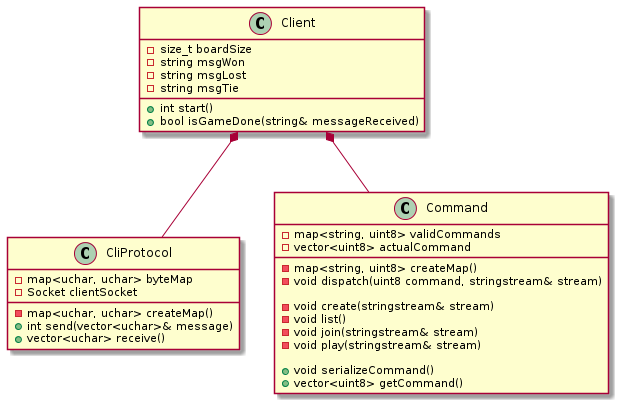
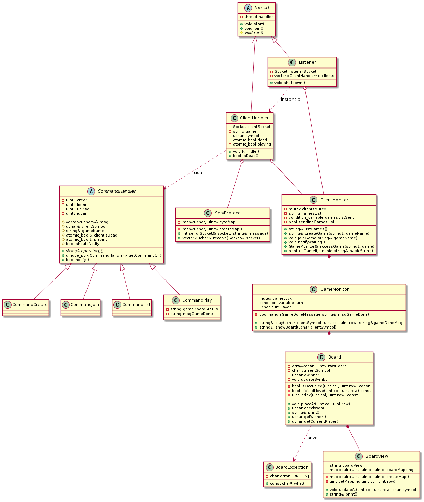
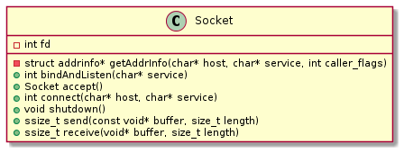

# TP3: Ta Te Ti

- Nombre: Leonardo Giampieri Mutti
- Padron: 102358
- URL: https://github.com/leogm99/tp2

## Introduccion

En el siguiente trabajo, se desarrolla el juego Ta Te Ti de manera distribuida y multicliente. Son dos programas, el programa Cliente y el Servidor. Cada instancia de un cliente podra conectarse a un Servidor para poder crear una partida, unirse, listar las partidas disponibles y jugar. Al ser multicliente, el servidor no solo requiere soporte para comunicacion mediante protocolos y sockets sino que tambien necesita poder manejar a multiples clientes de manera concurrente. El objetivo del trabajo es poner en practica el diseño y la construccion de sistemas con acceso distribuido, lograr el encapsulamiento de threads y sockets en diferentes clases, proteccion de recursos compartidos entre hilos y el uso de buenas practicas de programacion en C++.

## Ejecucion 

El servidor se puede lanzar de la siguiente manera:

`./server <PORT>`, donde `PORT` es el numero de puerto a utilizar.

Los clientes podran conectarse al servidor mediante el siguiente comando: 

`./client <HOST> <PORT>`, donde `HOST` es el hostname del servidor.

A su vez, los clientes pueden elegir de una lista de 4 comandos a ejecutar:

`listar`, lista las partidas que se han creado en el servidor y a las cuales el cliente podria unirse.

`crear <GAME>`, en donde `GAME` es el nombre de la partida que queremos crear.

`jugar <COL> <ROW>`, COL y ROW son la columna y la fila en la cual queremos hacer una jugada.

`unirse <GAME>`, nos permite unirnos a una partida si es que esta disponible para unirse o existe.

## Diseño

Muestro a continuacion diagramas de clase del Cliente y del Servidor.

Cada cliente tendra un serializador de comandos. A medida que este ingrese un comando, el serializador transforma la entrada a un lenguaje que interpreta el protocolo del servidor. El protocolo del cliente se encarga de encapsular la logica de envio y recepcion de mensajes.

El servidor es un poco mas grande. En main se instancian al `ClientMonitor` y al `Listener`. El `Listener` recibe nuevos clientes mientras no este apagado, y los va guardando en una estructura propia. Cada `ClientHandler` es un hilo aparte del de `Listener` y de main. `Listener` forwardea los objetos necesarios para que cada `ClientHandler` pueda realizar su ejecucion. A su vez, cada handler de cliente escuchará en su socket los comandos que vaya enviando el cliente, los cuales seran deserializados en alguna de las instancias de la clase `CommnandHandler`. Cada uno de estos functores encapsula la logica del comando, logrando asi reemplazar condicionales por polimorfismo y abstrayendo al cliente de la logica de los comandos. A su vez, estos se comunican con `ClientMonitor`, clase que resuelve y monitorea cada comando que el cliente quiere hacer. Aca se crean las partidas, se listan y los clientes se pueden unir tambien. Para la resolucion del comando jugar, necesitamos al `GameMonitor`. Este se encarga de proteger una partida para los dos clientes que estan tratando de acceder a ella. Dentro del metodo `play()`, se hace uso una condition variable que permite sincronizar los turnos. Luego se resuelve el envio del tablero teniendo en consideracion el estado de la partida. Este estado está encapsulado en las instancias de `Board`, que checkea si hay ganador/perdedor o empate. A su vez, la vista del tablero (y el mapeo de columna/fila a las coordenadas puras del string de la vista) es manejada por cada instancia de `BoardView`.

Lo unico que comparten cliente y servidor es el socket:

Una diferencia fundamental con el socket utilizado en el tp1 es que ahora `accept()` devuelve una instancia de un Socket, en vez de devolver un file descriptor, haciendo uso de un constructor privado de la clase.

## Problemas encontrados al desarrollar

Una data race que fue bastante complicada de encontrar estaba relacionada a la manera en la cual `Listener` guarda a cada `ClientHandler`.
En principio se habia pensado tener un vector de `ClientHandler` al cual se le podria realizar emplace_back, para no tener que hacer uso de punteros. Cuando la cantidad de clientes excede el maximo del tamaño del vector, este debe ser resizeado, y para eso se deben mover los objetos que estan adentro, esto es, se llama a su constructor por movimiento y se destruye la instancia anterior. El problema aparece si un cliente esta en un send/receive. Al tener el `ClientHandler` un `Socket`, mientras esta siendo movido, se modifica el file descriptor (se invalida con un -1). Si estoy en send/receive, estos metodos fallan, causando el break en el metodo `run()` y terminando la ejecucion de ese cliente. Esto se soluciono usando un vector de punteros a `ClientHandler`, eliminado esa data race, ya que al hacer el resize solo se mueven los punteros y no se toca el contenido.

Se realizaron checkeos de casos borde, en donde el cliente trata de hacer algo que no puede, como responderia el servidor a tal caso. Por ejemplo, cuando el servidor cierra al listener, debe esperar a que terminen todas las partidas que se estan jugando, y se decidio que al resto de los clientes que no estan jugando (ya sea que no tengan una partida en queue o que esten haciendo nada) se los mate en ese momento. Uno de los casos borde es cuando el servidor recibe una q, y justo un cliente se trata de unir a una partida. Se decidio que quede como una race condition. El servidor checkea si el cliente esta en una partida completa (esto es, con 2 jugadores), sino, se le cierra su socket. En este caso puede que un cliente entre justo antes a la partida o que el servidor llegue y lo mate antes de unirse. No hay sincronismo.
